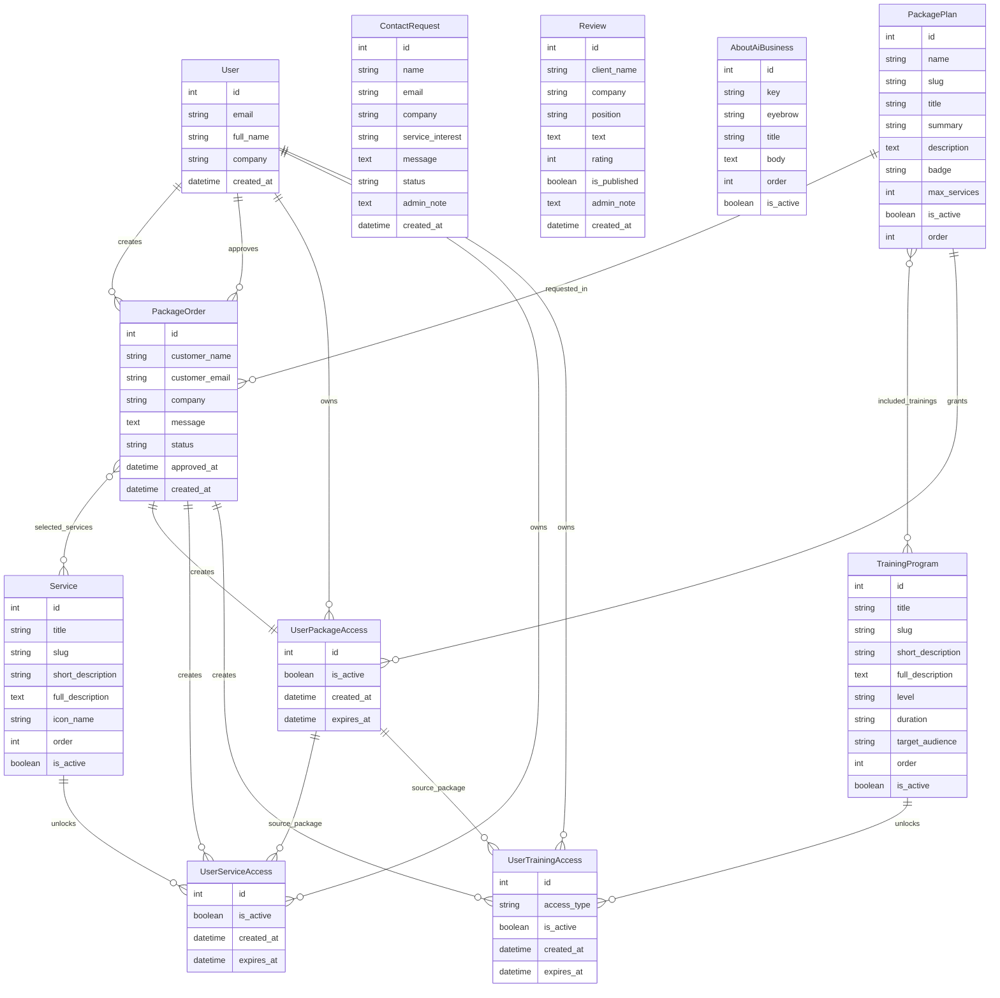

# Paradise Core 89

Codebase Overview

The project is organized into two main modules: a Django backend and a Vite-based frontend.

The backend contains the main business logic, API views, serializers, models, admin configuration, authentication flow, and database migrations.

The frontend contains a structured API layer, reusable page components, translation files, and separated SCSS modules for the visual system.

Current codebase size:

Backend core: 12 files
Backend migrations: 4 files
Frontend API layer: 9 files
Frontend components: 17 files
Frontend translations: 11 files
Frontend SCSS modules: 16 files
Entry and config files: 3 files

Total tracked project files in this overview: 69
Total lines of code and styles: 20,127

# AI Business
## Short Description
AI Business Paradise Core 89 is a web platform for presenting AI business services, training programs, package plans, reviews, contact requests, and user access features.


The project includes a custom frontend interface and a Django-based backend with admin-managed content and API endpoints.


## Current Status
The project is currently in active development.


Public deployment is not available yet.  
The application can be launched locally in a development environment.


## Features 
#### Frontend
- Vite-based frontend structure
- Multi-page SPA navigation
- Main Paradise Core pages: Home, Research, Divisions
- AI Business section with separate pages
- AI Business services catalog
- Service detail sections with structured descriptions
- Contact request page and contact forms
- Reviews section with review form
- Training programs page
- Package plans and package order request form
- User registration, login, logout and account area
- User access page for packages, services and trainings
- Header, burger menu and dynamic footer gateway
- Responsive SCSS layout
- Modular SCSS architecture by page/section
- API layer separated into dedicated frontend files
  

#### Backend
- Django backend application
- Django REST Framework API
- Services API with list and detail endpoints
- About AI Business content API
- Contact request creation
- Reviews and training reviews management
- Training programs API
- Package plans API
- Package order request system
- User registration, login, logout and JWT authentication
- User access system for packages, services and trainings
- PostgreSQL-ready Django project structure


#### Admin Panel
The project includes a Django admin panel that allows the administrator to manage the main AI Business system without editing the frontend code.

- Manage About AI Business content
- Manage services, descriptions, icons and display order
- Manage contact requests from users and companies
- Manage reviews and training-related reviews
- Manage training programs
- Manage package plans
- Review and moderate package order requests
- Approve package orders manually
- Manage users
- Control user access to packages, services and training programs


## Tech Stack

### Frontend
- HTML
- SCSS
- JavaScript
- Vite

### Backend
- Python
- Django
- Django REST Framework
- Django CORS Headers
- Simple JWT authentication
- Custom Django user model
- Django Admin

### Database
- PostgreSQL for development
- PostgreSQL planned for production
- 
### Authentication
- JWT access and refresh tokens
- User registration
- User login and logout
- Protected user account endpoints
- 
### Tools
- Git
- GitHub
- Django Admin
- VS Code


## Project Structure

## Project Architecture

```txt
PC89
│
├── backend/                         # Django + DRF backend
│   │
│   ├── aibusiness/                  # Core AI Business application
│   │   ├── admin.py                 # Admin panel configuration
│   │   ├── apps.py                  # Django app configuration
│   │   ├── models.py                # Database models and business entities
│   │   ├── serializers.py           # API data serializers
│   │   ├── urls.py                  # Application API routes
│   │   └── views.py                 # API views and request logic
│   │
│   ├── config/                      # Project settings and root configuration
│   └── manage.py                    # Django project management entry point
│
└── frontend/                        # Vite + JavaScript frontend
    │
    └── src/
        │
        ├── api/                     # API communication layer
        │   ├── client.js            # Axios client configuration
        │   ├── AuthApi.js           # Auth, registration, login and logout
        │   ├── servicesApi.js       # Services API requests
        │   ├── trainingApi.js       # Training programs API requests
        │   ├── reviewApi.js         # Reviews API requests
        │   ├── contactRequestApi.js # Contact request API requests
        │   ├── orderApi.js          # Package order requests
        │   ├── accessApi.js         # User access API requests
        │   └── aboutaibusiness.js   # About AI Business API requests
        │
        ├── components/              # Page rendering and UI logic
        │   ├── aibusiness-basepage.js
        │   ├── aibusiness-about.js
        │   ├── aibusiness-services.js
        │   ├── aibusiness-contact.js
        │   ├── aibusiness-review.js
        │   ├── aibusiness-training.js
        │   ├── aibusiness-package-prepare.js
        │   ├── aibusiness-hydrate.js
        │   ├── basepage.js
        │   ├── basepage-dev.js
        │   ├── burgermenu.js
        │   ├── header.js
        │   ├── footer.js
        │   ├── footer-dev.js
        │   ├── page-division.js
        │   ├── page-research.js
        │   └── user.js
        │
        ├── scss/                    # Modular SCSS design system
        │   ├── _variables.scss      # Shared variables
        │   ├── _header.scss         # Header and navigation
        │   ├── _footer.scss         # Footer and gateway styles
        │   ├── _basepage.scss       # Main landing page
        │   ├── _basepageaibusiness.scss
        │   ├── _aboutaibusiness.scss
        │   ├── _servicesaibusiness.scss
        │   ├── _contactaibusiness.scss
        │   ├── _reviewaibusiness.scss
        │   ├── _trainingaibusiness.scss
        │   ├── _preparepackageaibusiness.scss
        │   ├── _useraccess.scss
        │   ├── _userprofile.scss
        │   ├── _division.scss
        │   └── _research.scss
        │
        ├── main.js                  # SPA navigation and frontend initialization
        └── main.scss                # Main SCSS entry point
```


       
11. Добавь Frontend Overview
## Frontend Overview

The frontend is built with Vite, JavaScript and SCSS.  
It works as a modular single-page application where page rendering, navigation, authentication UI, API data loading and section-specific behavior are separated into dedicated modules.

The main frontend entry point is `main.js`.  
It initializes the application layout, renders the header, main page container and footer switcher, and controls navigation between the main Paradise Core pages and the AI Business section.

### Core frontend responsibilities

- Render the main application layout
- Switch between main pages: Home, Research, Divisions, Archives and AI Business
- Switch between AI Business pages: About, Services, Reviews, Training, Contact and User Access
- Initialize header navigation and AI Business navigation
- Initialize burger menu behavior
- Initialize authentication modal, login, registration, logout and current user check
- Load dynamic data from backend APIs
- Hydrate services, package plans, package order pages and user access data
- Handle package order preparation and package order form logic
- Handle contact request forms
- Handle reviews and review form submission
- Render service detail sections based on selected service slug
- Initialize dynamic footer switching
- Initialize language switch buttons

### Frontend architecture

The frontend is divided into several logical layers:

| Layer | Purpose |
|---|---|
| `main.js` | Main SPA entry point, page switching and initialization logic |
| `components/` | Page templates, UI rendering, forms and interaction logic |
| `api/` | Frontend communication with Django REST API |
| `scss/` | Modular SCSS styles for pages, layouts and UI sections |

### Main frontend areas

- Paradise Core base page
- Research page
- Divisions page
- AI Business landing page
- AI Business about page
- Services catalog
- Service detail sections
- Contact request page
- Reviews section
- Training programs page
- Package plans
- Package order preparation page
- User registration and login interface
- User account and access interface
- Header, burger menu and dynamic footer gateway


## Backend Overview

The backend is built with Django and Django REST Framework.  
It provides the main API layer for the AI Business direction of the project, including content management, authentication, package orders and user access control.

The backend is organized around the `aibusiness` Django app, which contains models, serializers, views, routes and admin configuration for the main business logic.

### Core backend responsibilities
- Provide REST API endpoints for the frontend
- Manage AI Business services and service detail data
- Store and deliver About AI Business content
- Handle contact requests from users and companies
- Manage reviews and published review content
- Manage training programs and training details
- Manage package plans and package order requests
- Handle user registration, login, logout and current user data
- Protect private user endpoints with authentication
- Control user access to packages, services and training programs
- Support admin moderation and manual access approval

### Authentication System

The project uses a custom Django user model with email-based authentication.  
Users can register, log in, log out and access their personal account data through protected API endpoints.

Authentication is handled with JWT access and refresh tokens using Simple JWT.

Main authentication features:

- Custom user model
- Email-based login
- User registration endpoint
- JWT access and refresh tokens
- Current user endpoint
- Logout with refresh token blacklist
- Protected user account API
- Admin-only access for sensitive user management actions

### AI Business API

The backend exposes API endpoints for the main AI Business sections:

- Services
- About AI Business content
- Contact requests
- Reviews
- Training programs
- Package plans
- Package orders
- User package access
- User service access
- User training access

Public content such as services, training programs, about content, reviews and package plans can be accessed without authentication.  
Private actions such as package orders and user access data require authenticated users.

### Package Order and Access Logic

The backend includes a package order system where authenticated users can request a package plan and select services.

After an order is reviewed and approved by an administrator, the system can create user access records for:

- Purchased package plan
- Selected services
- Included training programs

This creates a controlled access flow where package orders are connected to real user permissions inside the account area.

### Admin and Moderation Logic

The backend is designed to work together with Django Admin.  
Administrators can manage AI Business content, review user requests, moderate reviews, manage package plans and control user access.

Admin-controlled areas include:

- Services
- About AI Business content
- Contact requests
- Reviews
- Training programs
- Package plans
- Package orders
- User package access
- User service access
- User training access

| Layer | Purpose |
|---|---|
| `models.py` | Defines database structure and business entities |
| `serializers.py` | Converts model data into API-ready JSON and validates incoming requests |
| `views.py` | Handles API logic, permissions, authentication and request processing |
| `urls.py` | Connects API routes with viewsets |
| `admin.py` | Provides Django Admin management for project data |
| `config/` | Stores project settings and root Django configuration |


## API Modules

| Module | Purpose | Status |
|---|---|---|
| Services | Provides AI Business services list and service detail data | Implemented |
| Contact Requests | Handles contact form submissions from users and companies | Implemented |
| About AI Business | Stores editable content blocks for the about page | Implemented |
| Reviews | Handles review listing, creation and moderation workflow | Implemented |
| Training Programs | Provides training program list and detail data | Implemented |
| Package Plans | Provides available AI Business package plans | Implemented |
| Package Orders | Handles authenticated package order requests | Implemented |
| User Authentication | Handles registration, login, logout and current user data | Implemented |
| User Package Access | Provides user access to purchased package plans | Implemented |
| User Service Access | Provides user access to selected services | Implemented |
| User Training Access | Provides user access to included training programs | Implemented |
| Admin Panel | Allows content, requests, orders and access management | Implemented |


## Database Models

The backend uses Django models to store and manage AI Business data, user accounts, package orders and access permissions.

Main model groups:

- **User models** — custom email-based user model
- **Service models** — AI Business services and service detail data
- **Contact request models** — user and company contact submissions
- **Review models** — client reviews with publication status
- **Training program models** — training programs with levels, duration and audience
- **About content models** — editable About AI Business content blocks
- **Package plan models** — available business packages and included trainings
- **Package order models** — authenticated user package requests
- **User access models** — package, service and training access records


## Main Model Groups

| Group | Models | Purpose |
|---|---|---|
| Users | `User` | Custom email-based user accounts |
| Content | `Service`, `AboutAiBusiness` | AI Business public content |
| Requests | `ContactRequest`, `PackageOrder` | User and company requests |
| Reviews | `Review` | Client reviews and moderation |
| Training | `TrainingProgram` | Training programs and included package trainings |
| Packages | `PackagePlan` | AI Business package plans |
| Access | `UserPackageAccess`, `UserServiceAccess`, `UserTrainingAccess` | User permissions after package approval |

## Database Relationship Diagram



## Local Development

This section explains how to run the project locally for the first time.

The project has two separate parts:

- `backend/` — Django + Django REST Framework API
- `frontend/` — Vite + JavaScript + SCSS frontend

Backend and frontend should be started in **two separate terminals**.

---

## 1. Requirements Before Start

Before running the project, make sure you have installed:

- Python
- Node.js
- npm
- Git
- Internet connection

Internet connection is required for installing backend and frontend dependencies.

Check installed versions:

```bash
python --version
node --version
npm --version
git --version
```

---

## 2. Clone or Open the Project

Open the project folder in VS Code or terminal.

Example project structure:

```txt
project-root/
  backend/
  frontend/
  README.md
  requirements.txt
```

---

# Backend Setup

## 3. Go to Backend Folder

Open the first terminal and go to the backend folder:

```bash
cd backend
```

## 4. Create Virtual Environment

```bash
python -m venv venv
```

## 5. Activate Virtual Environment

Windows:

```bash
venv\Scripts\activate
```

After activation, the terminal should show:

```txt
(venv)
```

## 6. Install Backend Dependencies

```bash
pip install -r requirements.txt
```

Backend dependencies:

```txt
asgiref==3.11.1
Django==6.0.5
django-cors-headers==4.9.0
djangorestframework==3.17.1
djangorestframework_simplejwt==5.5.1
psycopg==3.3.4
psycopg-binary==3.3.4
PyJWT==2.13.0
sqlparse==0.5.5
tzdata==2026.2
```

## 7. Apply Database Migrations

```bash
python manage.py migrate
```

## 8. Create Admin User

```bash
python manage.py createsuperuser
```

## 9. Run Backend Server

```bash
python manage.py runserver
```

Backend URL:

```txt
http://127.0.0.1:8000/
```

Django Admin:

```txt
http://127.0.0.1:8000/admin/
```

API root:

```txt
http://127.0.0.1:8000/api/
```

Keep this terminal open.

---

# Frontend Setup

## 10. Open Second Terminal

Open a new terminal window.  
Do not stop the backend server.

## 11. Go to Frontend Folder

```bash
cd frontend
```

## 12. Install Frontend Dependencies

```bash
npm install
```

## 13. Run Frontend Development Server

```bash
npm run dev
```

Frontend URL:

```txt
http://localhost:5173/
```

Open this URL in your browser.

---

# Final Local Run

After the first setup, daily project start is shorter.

## Terminal 1 — Backend

```bash
cd backend
venv\Scripts\activate
python manage.py runserver
```

## Terminal 2 — Frontend

```bash
cd frontend
npm run dev
```

---

# Open in Browser

Frontend:

```txt
http://localhost:5173/
```

Backend:

```txt
http://127.0.0.1:8000/
```

Django Admin:

```txt
http://127.0.0.1:8000/admin/
```

API:

```txt
http://127.0.0.1:8000/api/
```

## Roadmap

### 1. Project Foundation

- [x] Django backend project structure
- [x] AI Business Django app
- [x] Django Admin integration
- [x] Frontend project structure
- [x] Responsive SCSS structure

### 2. Public AI Business Content

- [x] Services API
- [x] Service list endpoint
- [x] Service detail endpoint by slug
- [x] About AI Business content API
- [x] Training programs API
- [x] Package plans API
- [x] Reviews API
- [x] Review creation and moderation logic
- [x] Contact request API

### 3. Authentication and User System

- [x] Custom user model
- [x] User registration
- [x] User login
- [x] User logout
- [x] JWT authentication with access and refresh tokens
- [x] Current user endpoint
- [x] Protected user account endpoints

### 4. Package Orders and Access Logic

- [x] Package order request API
- [x] User package access model
- [x] User service access model
- [x] User training access model
- [x] Package approval logic
- [x] Admin-controlled access creation

### 5. Frontend Integration

- [x] Frontend API integration
- [x] AI Business frontend pages
- [x] Services catalog frontend
- [x] Service detail sections
- [x] About page integration
- [x] Contact request form
- [x] Reviews section and review form
- [x] Training programs page
- [x] Package plans frontend
- [x] Package order frontend flow
- [x] User account interface
- [x] Awaiting commission review and feedback

###  UPGRADE


###  In Progress

- [ ] Advanced Python: closures, *args/**kwargs, decorators, descriptors, metaclasses, and advanced typing

